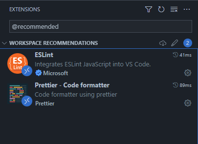

# typescript-templates

List of opinionated templates for typescript projects. And also a mini-guide to set up a new project manually (at the end).

This is in no way a comprehensive selection of different, exotic repositories - but there is enough difference between them to warrant this documentation.

- [so... what's this?](#so-whats-this)
- [the templates](#the-templates)
  - [ts-node](#ts-node)
- [doing it manually](#doing-it-manually)
  - [vscode setup](#vscode-setup)
  - [project initialization](#project-initialization)
  - [commitlint](#commitlint)
  - [eslint](#eslint)
  - [prettier](#prettier)
  - [jest](#jest)
  - [lint-staged](#lint-staged)
  - [husky](#husky)
  - [github actions and sonarcloud](#github-actions-and-sonarcloud)

---

## so... what's this?

It's mainly about the configurations of dev dependencies and/or file structures that need to be adjusted for one reason or another - and preserving them in templates is as good documentation as any, methinks.

<details>
<summary>So, it's the same good, old "build system" using 👇:</summary>

- vscode settings

  - two extension recommendations for the workspace:
    - [vscode-eslint](https://github.com/Microsoft/vscode-eslint) to get linting feedback
    - [prettier-vscode](https://github.com/prettier/prettier-vscode) to format code on the fly
  - configuration to actually use these two extensions as intended - fixing/formatting on save, paste, edit, etc

- some dotfiles for good measure

  - .gitignore, which is very very self explanatory
  - [.editorconfig](https://editorconfig.org/) with sane settings for typescript

- commiting

  - [commitlint](https://github.com/conventional-changelog/commitlint) is a cli to use as a git hook to intercept and lint git commit messags using the [conventional commit format](https://www.conventionalcommits.org/en/v1.0.0/)

- transpiling
  - a strict, default-ish `tsconfig.json` that uses a "top level" `#/*` path for imports - and a `tsconfig.build.json` in some cases
  - [nodemon](https://github.com/remy/nodemon) with [ts-node](https://github.com/TypeStrong/ts-node) to keep the ball rolling during development
  - [tsconfig-paths](https://github.com/dividab/tsconfig-paths) and [tsc-alias](https://github.com/justkey007/tsc-alias) to allow [typescript paths for module resolution](https://www.typescriptlang.org/docs/handbook/module-resolution.html#additional-module-resolution-flags) both during development and after transpilation
  - [tsc-files](https://github.com/gustavopch/tsc-files) to check types in `lint-staged` without ignoring `tsconfig.json` - this is an [old tsc issue](https://github.com/microsoft/TypeScript/issues/27379)
- linting

  - [eslint](https://github.com/eslint/eslint)
  - configuration using [airbnb's excellent guide](https://github.com/airbnb/javascript) as base, with [typescript support](https://github.com/iamturns/eslint-config-airbnb-typescript) and a few customized rules

- formatting

  - [prettier](https://github.com/prettier/prettier)
  - a mostly default-y configuration, using [trivago's plugin](https://github.com/trivago/prettier-plugin-sort-imports) to sort imports

- testing

  - [jest](https://github.com/facebook/jest)
  - a mostly default configuration that understands the import paths configured in `tsconfig.json`

- putting it all together

  - [lint-staged](https://github.com/okonet/lint-staged) to run tools (type checking, linting, formatting, testing) on commited files only
  - [husky](https://github.com/typicode/husky) to set up the git hooks for `commitlint` and `lint-staged`

- some CI
  - [github actions](https://docs.github.com/en/actions) used to run tests
  - [sonarclound](https://sonarcloud.io/login) as static code analysis

</details>

---

## the templates

### ts-node

**<https://github.com/mkvlrn/ts-node>**

The simplest of them all. A base node project without any dependencies other than dev.

---

## doing it manually

This could be used as a step-by-step guide to set up a new project or just to pick and choose what to add.

It's ordered in a manner that makes sense for someone creating a new project from scratch.

It is assumed you use vscode as your editor, yarn as your package manager, and are developing in a linux-like environment (wsl2 works perfectly).

### vscode setup

<details>
<summary><b>create file:</b> <i>.vscode/settings.json</i></summary>

```json
{
  "editor.defaultFormatter": "esbenp.prettier-vscode",
  "editor.codeActionsOnSave": {
    "source.fixAll": true
  },
  "editor.formatOnPaste": true,
  "editor.formatOnSave": true,
  "editor.formatOnType": true,
  "editor.rulers": [80],
  "editor.wordWrap": "wordWrapColumn",
  "eslint.alwaysShowStatus": true,
  "eslint.validate": [
    "javascript",
    "javascriptreact",
    "typescript",
    "typescriptreact"
  ],
  "typescript.preferences.importModuleSpecifier": "non-relative"
}
```

</details>

<details>
<summary><b>create file:</b> <i>.vscode/extensions.json</i></summary>

```json
{
  "recommendations": ["dbaeumer.vscode-eslint", "esbenp.prettier-vscode"]
}
```

</details>
<br/>

Then, just install the extensions listed in _workspace recommendations_:


### project initialization

**cmd:** _git init, node project start, couple scripts, and first dependencies_

```bash
git init
yarn init -y
npm pkg set scripts.prebuild="npx rimraf build"
npm pkg set scripts.build="npx tsc -p tsconfig.build.json && npx tsc-alias -p tsconfig.build.json"
npm pkg set scripts.dev="npx nodemon src/index.ts"
npm pkg set scripts.start="node build"
yarn add typescript \
         nodemon \
         tsc-alias \
         ts-node \
         tsconfig-paths \
         rimraf \
         @types/node -D
```

<details>
<summary><b>create file:</b> <i>.gitignore</i></summary>

```gitignore
node_modules
coverage
build
```

</details>

<details>
<summary><b>create file:</b> <i>.editorconfig</i></summary>

```editorconfig
root = true

[*]
end_of_line = lf
insert_final_newline = true
indent_style = space
indent_size = 2
trim_trailing_whitespace = true
max_line_length = 80
```

</details>

<details>
<summary><b>create file:</b> <i>nodemon.json</i></summary>

```json
{
  "execMap": {
    "ts": "ts-node"
  },
  "ext": "ts,json"
}
```

</details>

<details>
<summary><b>create file:</b> <i>tsconfig.json</i></summary>

```json
{
  "compilerOptions": {
    "module": "CommonJS",
    "target": "ESNext",
    "lib": ["ESNext", "DOM", "DOM.Iterable"],
    "rootDir": ".",
    "baseUrl": ".",
    "paths": {
      "#/*": ["src/*"]
    },
    "allowJs": false,
    "allowSyntheticDefaultImports": true,
    "esModuleInterop": true,
    "emitDecoratorMetadata": true,
    "experimentalDecorators": true,
    "forceConsistentCasingInFileNames": true,
    "isolatedModules": true,
    "jsx": "react-jsx",
    "moduleResolution": "node",
    "noEmit": true,
    "removeComments": true,
    "resolveJsonModule": true,
    "skipLibCheck": true,
    "strict": true
  },
  "include": ["./src", "./test", "*.config.*"],
  "ts-node": {
    "require": ["tsconfig-paths/register"]
  }
}
```

</details>

<details>
<summary><b>create file:</b> <i>tsconfig.build.json</i></summary>

```json
{
  "extends": "./tsconfig.json",
  "compilerOptions": {
    "rootDir": "./src",
    "outDir": "build",
    "noEmit": false
  },
  "include": ["./src"],
  "exclude": ["./src/**/*.spec.ts"]
}
```

</details>

### commitlint

**cmd:** _install dependencies_

```bash
yarn add @commitlint/cli @commitlint/config-conventional -D
```

<details>
<summary><b>create file:</b> <i>.commitlintrc.json</i></summary>

```json
{
  "extends": ["@commitlint/config-conventional"]
}
```

</details>

### eslint

**cmd:** _install dependencies_

```bash
yarn add eslint \
         eslint-config-airbnb \
         eslint-config-airbnb-typescript \
         eslint-config-prettier \
         eslint-import-resolver-typescript \
         eslint-plugin-import \
         eslint-plugin-jest \
         eslint-plugin-jsx-a11y \
         eslint-plugin-react \
         eslint-plugin-react-hooks \
         @typescript-eslint/eslint-plugin \
         @typescript-eslint/parser -D
```

<details>
<summary><b>create file:</b> <i>.eslintrc.json</i></summary>

```json
{
  "root": true,
  "parser": "@typescript-eslint/parser",
  "parserOptions": {
    "ecmaVersion": "latest",
    "project": "./tsconfig.json",
    "sourceType": "module"
  },
  "extends": [
    "airbnb",
    "airbnb-typescript",
    "airbnb/hooks",
    "plugin:react/jsx-runtime",
    "plugin:import/errors",
    "plugin:import/warnings",
    "plugin:import/typescript",
    "plugin:jest/recommended",
    "plugin:jest/style",
    "prettier"
  ],
  "plugins": ["jest"],
  "env": {
    "node": true,
    "browser": true,
    "jest": true
  },
  "settings": {
    "import/resolver": {
      "typescript": {}
    },
    "jest": {
      "version": "latest"
    }
  },
  "ignorePatterns": ["node_modules", "build", "coverage"],
  "rules": {
    "jsx-a11y/label-has-associated-control": "off",
    "jsx-a11y/no-noninteractive-element-interactions": "off",
    "react/jsx-props-no-spreading": "off",
    "no-underscore-dangle": "off",
    "no-nested-ternary": "off",
    "import/prefer-default-export": "off",
    "class-methods-use-this": "off",
    "@typescript-eslint/no-unused-vars": [
      "error",
      {
        "argsIgnorePattern": "^_"
      }
    ],
    "jest/expect-expect": [
      "error",
      {
        "assertFunctionNames": ["expect", "pactum.**.expect*"]
      }
    ]
  }
}
```

</details>

### prettier

**cmd:** _install dependencies_

```bash
yarn add prettier @trivago/prettier-plugin-sort-imports -D
```

<details>
<summary><b>create file:</b> <i>.prettierrc.json</i></summary>

```json
{
  "semi": true,
  "singleQuote": true,
  "printWidth": 80,
  "endOfLine": "lf",
  "trailingComma": "all",
  "jsxSingleQuote": true,
  "overrides": [
    {
      "files": ["*.json", "*.jsonc", ".*rc"],
      "options": {
        "parser": "json-stringify"
      }
    }
  ],
  "importOrder": ["^#(.*)/", "^[./]"],
  "importOrderSeparation": true,
  "importOrderSortSpecifiers": true,
  "importOrderCaseInsensitive": true,
  "importOrderParserPlugins": ["typescript", "jsx", "decorators-legacy"]
}
```

</details>

### jest

**cmd:** _install dependencies, add test script_

```bash
yarn add jest \
         ts-jest \
         jest-environment-jsdom \
         jest-transform-stub \
         @types/jest -D
npm pkg set scripts.test="jest"
```

<details>
<summary><b>create file:</b> <i>jest.config.ts</i></summary>

```ts
import { Config } from "jest";
import { pathsToModuleNameMapper } from "ts-jest";

import { compilerOptions } from "./tsconfig.json";

const config: Config = {
  passWithNoTests: true,
  preset: "ts-jest",
  rootDir: "./",
  testRegex: ".spec.(ts|tsx)$", // "spec" for unit tests, "test" for integration or e2e
  testEnvironment: "node", // "jsdom" for react
  moduleNameMapper: pathsToModuleNameMapper(compilerOptions.paths, {
    prefix: "<rootDir>",
  }),
  transform: {
    "^.+.(png|svg|jpg|gif|webp)$": "jest-transform-stub",
  },
  coverageDirectory: "coverage",
  collectCoverageFrom: ["./src/**/*.{ts,tsx}", "!**/index.{ts,tsx}"],
};

export default config;
```

</details>

### lint-staged

**cmd:** _install dependencies_

```bash
yarn add lint-staged tsc-files -D
```

<details>
<summary><b>create file:</b> <i>.lintstagedrc.json</i></summary>

```json
{
  "*.(ts|tsx)": [
    "npx tsc-files",
    "npx eslint --fix",
    "npx prettier --write",
    "npx jest --bail --findRelatedTests"
  ],
  "*.json": ["npx prettier --write"]
}
```

</details>

### husky

**cmd:** _install dependency and set up hooks_

there's a `sed` step in there because of [this issue](https://github.com/typicode/husky/issues/924)

```bash
yarn add husky -D
npm pkg set scripts.prepare="npx husky install"
yarn prepare
npx husky add .husky/pre-commit 'npx lint-staged -v'
npx husky add .husky/commit-msg 'npx --no-install -- commitlint --edit'
sed -i 's/^npx.*/& $1/' .husky/commit-msg
```

### github actions and sonarcloud

Using github actions to run tests on pushes or new PRs is straightforward, but adding code and coverage analysis to it is a bit more complicated, and requires some extra steps outside of what can be done just with configuration files.

A reminder that the free sonar cloud service is only available to public repositories, and I've only tested it with github, although it probably works the same way with any other services such as gitlab or bitbucket.

If code analysis is not needed at the moment, just don't create the `sonar-project.properties` file, and don't add the second step to the job in the workflow file - the testing step will work by itself just fine.

But if it is, before configuring it, you'll need to:

- create a free [sonar cloud account](https://www.sonarsource.com/products/sonarcloud/signup/)

- add your "organization" to it, which would be your personal github account or a proper github organization

- add a new project to be analyzed by selecting one of the available ones (they'll show up after adding your organization) - again, only public repos can be analyzed for free

- disable automatic analysis for the project by going to _**Administration -> Analysis Method -> Automatic Analysis**_ and turning it off - this is done in order to gain full control of the analysis in the configuration file setup in here

- create an access token for the project by going to _**My Account -> Security**_ - copy it and save it in your repository as a new Secret (Actions) named `SONAR_TOKEN`

Now you have both a Sonarcloud organization and a project key, that can be checked in _**[Your project] -> Information**_ - organization key will be something like `mygithubusername-sonar` and project key like `mygithubusername_myprojectname`, and these values will be used in the example configuration below.

<details>
<summary><b>create file:</b> <i>sonar-project.properties</i></summary>

```properties
sonar.organization=mygithubusername-sonar
sonar.projectKey=mygithubusername_ts-node
sonar.language=ts
sonar.sources=./src
sonar.coverage.exclusions=**/*.spec.ts,**/.spec.tsx,**/index.ts,**/index.tsx
sonar.javascript.lcov.reportPaths=coverage/lcov.info
```

</details>

<details>
<summary><b>create file:</b> <i>.github/workflows/test-and-analyze.yml</i></summary>

```yml
name: test-and-analyze
on:
  push:
    branches:
      - main
  pull_request:
    types:
      - opened
      - synchronize
      - reopened
jobs:
  test:
    runs-on: ubuntu-latest
    steps:
      - name: checkout
        uses: actions/checkout@v3
        with:
          fetch-depth: 0
      - name: install dependencies
        run: yarn install
      - name: run tests
        run: yarn test --coverage
      - name: save artifact for sonar
        uses: actions/upload-artifact@v3
        with:
          name: artifact
          path: coverage
  sonarcloud:
    runs-on: ubuntu-latest
    needs: test
    steps:
      - name: checkout
        uses: actions/checkout@v3
        with:
          fetch-depth: 0
      - name: download artifact
        uses: actions/download-artifact@v3
        with:
          name: artifact
          path: ./coverage
      - name: trigger scan
        uses: sonarsource/sonarcloud-github-action@master
        env:
          GITHUB_TOKEN: ${{ secrets.GITHUB_TOKEN }}
          SONAR_TOKEN: ${{ secrets.SONAR_TOKEN }}
```

</details>
<br />

This configuration is also very opinionated regarding test coverage, but other settings follow the "Sonar Way" default configurations of Sonarcloud.
